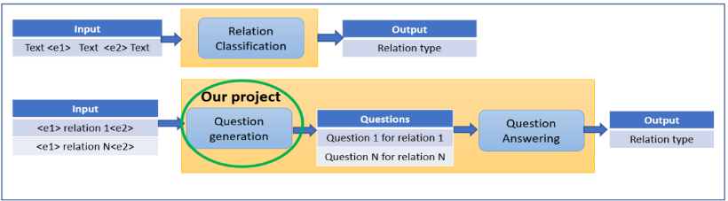

# nlp-questions-generation-from-relations
NLP project: Questions generation from relations
By: Gil Levy and Liad Levi-Raz

NLP course final project in Reichman university 2022

# Abstract

Motivated by the paper “Supervised Relation Classification as Two-way Span-Prediction”  (https://arxiv.org/pdf/2010.04829.pdf) we propose a method to generate questions that represent different  relations in a sentence. This paper proposes an improved method for relation classification: The main idea is  introducing questions (one/few per relation) to a question / answer model and classifying the relation based  on the questions that lead to the correct answer. In case of many questions per relation and tie score between  number of correct answers any heuristics can be applied to classify the relation. The question generation is an  important building block of this architecture .A question represents a relation in a form that the answer is  either the subject entity or the object entity.

# How to run the code

The code is provided as 3 Colab notebooks, Preprocessing NB, Simple Model NB and Enhanced Model NB.

Basically you just open them in Colab and 'Run all' after obtaining the datasets.

(Note: A GPU is needed for the two Model notebooks)

# Preprocessing Notebook

Colab link: https://colab.research.google.com/drive/1xcy9zDnt28H4RVQpAU_73rPNCGjUKuBc?usp=sharing

There is no need to run this NB, as the preprocessed datasets links were provided for each NB

(If you do wish to run it from scratch - it is possible but please contact us first as it requires 
to regiser to Google Cloud APIs for getting access to the Google Knowledge Graph API)

# Simple Question Generation Notebook

Dataset: https://drive.google.com/drive/folders/10M0YgJ9-OOUsaC41JvxreJGs-JFqUM3n?usp=sharing (originally downloaded from huggingface)

Colab link: https://colab.research.google.com/drive/1jSTHZSi58LfHC8eUpKPZ7PLIepsoH27y?usp=sharing

Download the dataset files, and upload them to Colab (using the file browser).

The dataset files are expected to be under: 

- /content/data/train_14k_df.csv

- /content/data/val_14k_df.csv

- /content/data/test_14k_df.csv

Run the notebook - this will run a full training (if you wish to use our pretrained model please contact us)

# Enhanced Question Geneeration Notebook

Preprocessed dataset:https://drive.google.com/drive/folders/1og5PyaisweVKtx1UwVqURpsVs9yQLXPr?usp=sharing

Colab link: https://colab.research.google.com/drive/1QhCOJCHOlTRi6ncrY-orqYE1Qg4r-TG9?usp=sharing

Download the dataset files, and upload them to Colab. The dataset files are expected to be under: 

- data/p2/p2_train_seq2seq_df.csv

- data/p2/p2_val_seq2seq_df.csv

- data/p2/p2_test_seq2seq_df.csv

Run the notebook - this will run a full training (if you wish to use our pretrained model please contact us)

